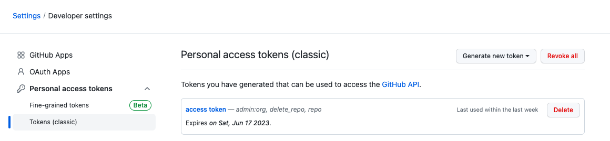
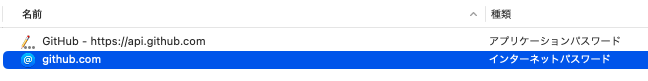

# Github

# 「The requested URL returned error: 403」のエラーの対処法
```
$ git push -u origin <ブランチ名>
```
上のようにpushを実行すると、下のエラーが出ることがある。
```
remote: Permission to <ユーザー名>/<リポジトリ名>.git denied to <ユーザー名>.
fatal: unable to access 'https://github.com/<ユーザー名>/<リポジトリ名>.git/': The requested URL returned error: 403
```
## Access Tokenを作成
1. Githubにアクセス
2. 「Settings」をクリック
3. 「Profile>Developer settings」をクリック
4. Personal access tokens>Tokens(classic)をクリックし、「Generate new token」をクリックし、「Generate new token(classic)」をクリック

  

5. Noteにトークン名を入力、Expirationに有効期限を設定、Select scopesにrepo（リポジトリにアクセスする）にチェックする。
6. 「Generate Token」をクリック
7. 表示されているランダムな文字、Access Tokenをコピー（再表示されない）

## キーチェーンアクセスにAccess Tokenを設定
1. Macのキーチェーンをクリック
2. 「github.com」(と「https://api.github.com」)をクリック
  
3. 「パスワードを表示」にチェックして、元々書いてあったパスワードを消して、「Access Tokenを作成」の7でコピーしたAccess Tokenを貼り付け、保存する。
4. もう一度pushし、成功。

 ## 参考リンク

[【GitHub】authentication failedの解決方法【２段階認証】](https://donachikiblog.com/github-authentication-failed/):Access Tokenを作成

[【突然GitHubにpushできなくなった】 トークン生成で解決：The requested URL returned error: 403](https://zenn.dev/yuri0427/articles/9587ae6a578ee9):Access Tokenの設定

[【MacのキーチェーンにGitHubのパーソナルアクセストークンを登録する](https://zenn.dev/chiyopu/articles/914236cd59d4f3):Access Tokenの設定

<script src="https://blz-soft.github.io/md_style/release/v1.2/md_style.js" ></script>
