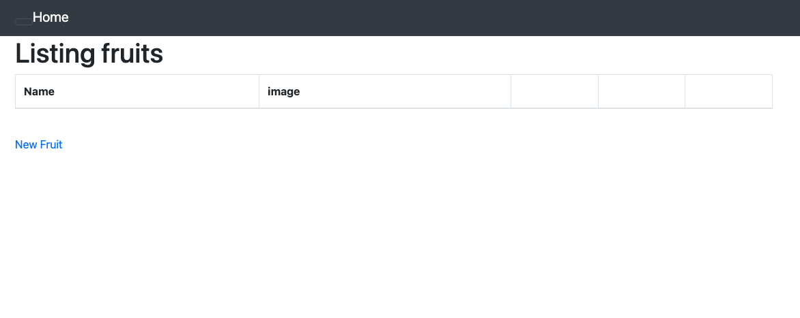
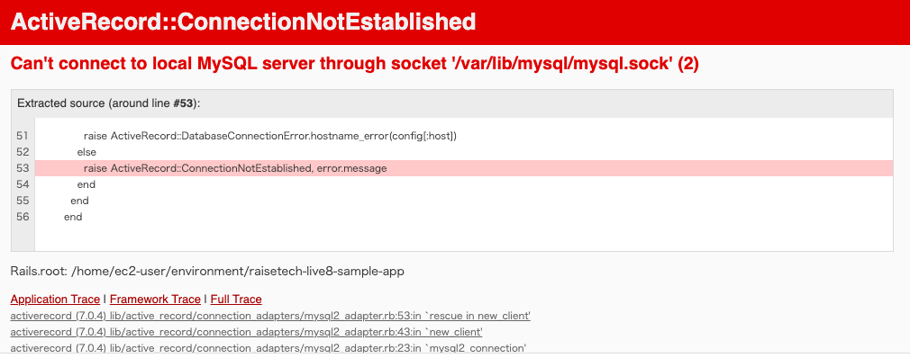

# 第３回課題
## APサーバについて調べる
- APサーバーの名前はpuma、バージョンは5.6.5

以下のコマンドを実行する。以下のコマンドはAPサーバーを起動するもの。
```
rails s
```
コマンドを実行した結果以下の表示になる。
```
=> Booting Puma
=> Rails 7.0.4 application starting in development 
=> Run `bin/rails server --help` for more startup options
Puma starting in single mode...
* Puma version: 5.6.5 (ruby 3.1.2-p20) ("Birdie's Version")
*  Min threads: 5
*  Max threads: 5
*  Environment: development
*          PID: 16418
* Listening on http://127.0.0.1:8080
* Listening on http://[::1]:8080
Use Ctrl-C to stop
^C- Gracefully stopping, waiting for requests to finish
=== puma shutdown: 2023-05-17 14:35:47 +0000 ===
- Goodbye!
Exiting
```
- APサーバーを終了させた場合、アクセスはできない。以下の画面が表示される。
  

 
- APサーバーを起動してアクセスすると、以下の画面が表示される。
  


## DBサーバーについて調べる
- サンプルアプリケーションで使ったDBサーバーの名前は、MySQL。
- MySQLのバージョンは8.0.33。

以下はMySQLのバージョンを表示するコマンド。
``` 
mysql --version
```

上のコマンドを実行すると以下のように表示される。
```
mysql  Ver 8.0.33 for Linux on x86_64 (MySQL Community Server - GPL)
```

- DBサーバーを終了させた場合

以下はDBサーバーを停止させるコマンド。
```
sudo service mysqld stop
```
以下の画像は、DBサーバを停止した後にアクセスした時の画像。アクセスできない。ソケットがないというエラーが出ている。
  

## Railsの構成管理ツールの名前
今回使用したツールはBundler。

## 今回の課題から学んだこと
- 今回、Ruby on Rails で Web アプリケーション起動することができた。いろんなコマンドが出てきて最初はよくわからなかったが、復習し、理解を深めることができた。
- gemとは、Ruby用の外部ライブラリのこと。
- bundlerとは、gemをインストールするツール。

## 参考リンク
[Cloud9のMySQLをバージョンアップする方法 - Qiita](https://qiita.com/takahashitakuya031126/items/5ce3edc499a161c02a1e):MySQLについてのページ

[【AWS/cloud9】SQL起動方法と簡単な使い方 - Qiitas](https://qiita.com/takahashiryoma/items/b405a17836cb58fd149d):MySQLについてのページ

[【Ruby】 gemの仕組みを図解形式で学ぼう | Pikawaka](https://pikawaka.com/ruby/how-gem-works):gemについてのページ

[【Rails】 結局bundlerって何？bundlerの仕組みを図解形式で徹底解説 | Pikawaka](https://pikawaka.com/rails/bundler):Bundlerについてのページ


<script src="https://blz-soft.github.io/md_style/release/v1.2/md_style.js" ></script>
