# 第4回課題

## AWSの料金アラートの設定について
### 方法1:請求アラートを設定
1. サービス「Billing」にアクセス
2. 「請求設定」>「アラート設定」でメールアドレスを設定。AWSの無料枠を超えたら通知がくる。

### 方法2:予算アラートを設定
1. サービス「Budgets」にアクセス
2. 「予算の作成」をクリック
3. 必要事項入力して予算作成。今回は1ヶ月で500円オーバーしたら通知が来るように設定。

   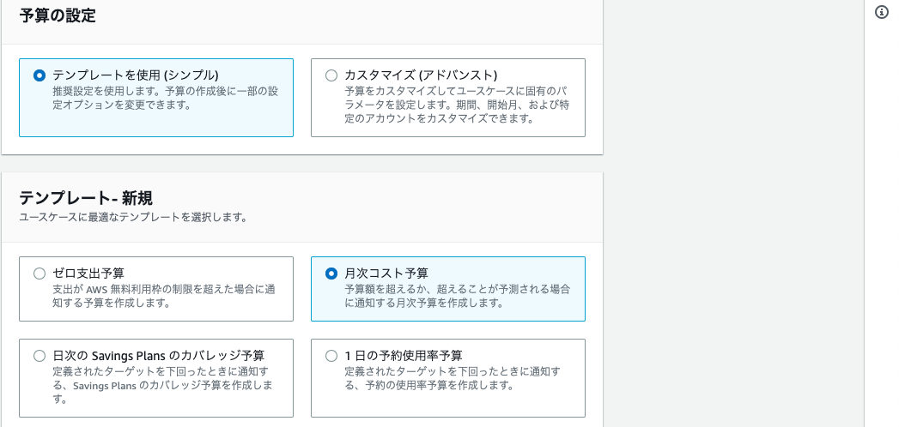  

   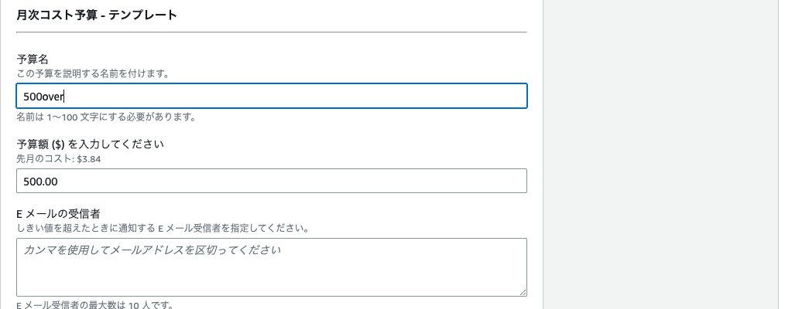  

+ 参考リンク
  + [AWSの料金アラートの違い](https://zenn.dev/sakojun/articles/20210618-aws-cost-alart)
   
  + [【AWS】（2022年版）予算アラートの設定方法 - 自由気ままに書いちゃおう](https://www.guri2o1667.work/entry/2022/05/03/%E3%80%90AWS%E3%80%91%EF%BC%882022%E5%B9%B4%E7%89%88%EF%BC%89%E4%BA%88%E7%AE%97%E3%82%A2%E3%83%A9%E3%83%BC%E3%83%88%E3%81%AE%E8%A8%AD%E5%AE%9A%E6%96%B9%E6%B3%95)

  + [AWS クラウド無料利用枠 | AWS](https://aws.amazon.com/jp/free/?gclid=CjwKCAjwvdajBhBEEiwAeMh1U9cI7AUyerjFZzzKTCkpE4_5cPQIbDAcPUTEzoGzCMrqtf8b2nIv5xoCoA8QAvD_BwE&trk=340f68be-e761-4b5a-b753-222dc31677b5&sc_channel=ps&ef_id=CjwKCAjwvdajBhBEEiwAeMh1U9cI7AUyerjFZzzKTCkpE4_5cPQIbDAcPUTEzoGzCMrqtf8b2nIv5xoCoA8QAvD_BwE:G:s&s_kwcid=AL!4422!3!618145042460!p!!g!!amazon%20aws&all-free-tier.sort-by=item.additionalFields.SortRank&all-free-tier.sort-order=asc&awsf.Free%20Tier%20Types=*all&awsf.Free%20Tier%20Categories=*all)

## AWSの環境構築
### VPCとサブネットを作成
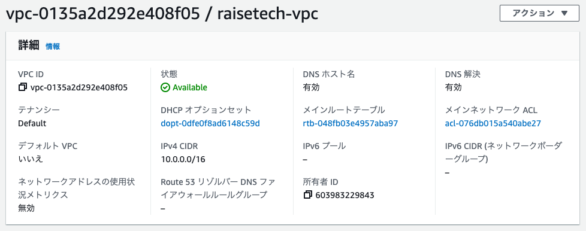  

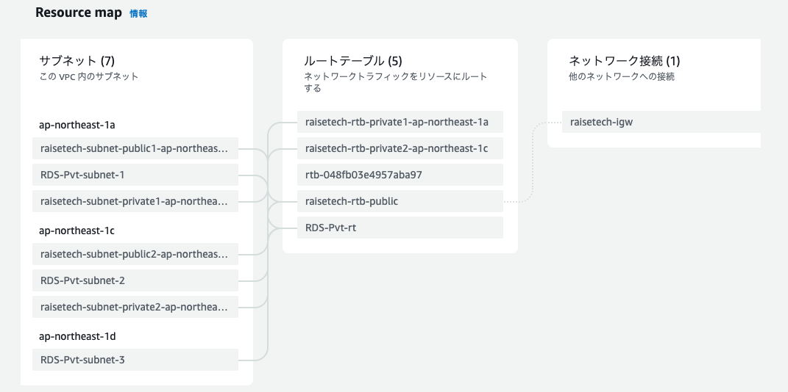  

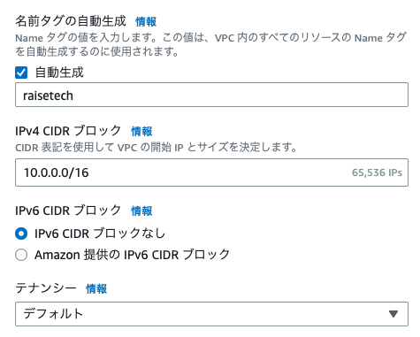  

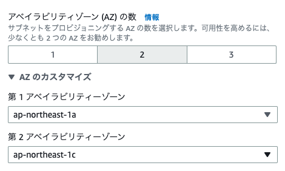  

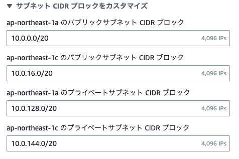  

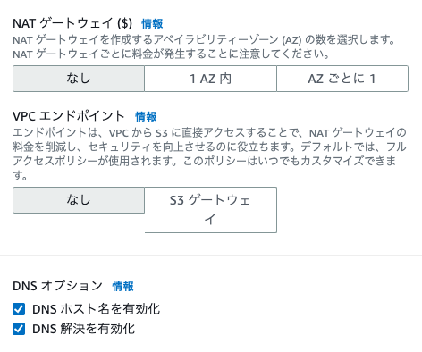  


+ IPv4 CIDR ブロック：VPCにおけるIPアドレスの範囲を設定する。今回は10.0.0.0/16なので、範囲は10.0.0.0~10.0.255.255。

  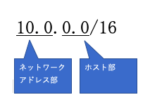  

  どのネットワークか→ネットワーク部

  どのコンピュータか→ホスト部

  今回のサブネットマスクアドレスは、10進数で書いた場合は255.255.0.0、2進数で書いた場合は11111111.11111111.0.0で1の部分がネットワーク部、0の部分がホスト部。

+ サブネット

    10.0.0.0/20 範囲：10.0.0.0~10.0.15.255

    10.0.16.0/20 範囲：10.0.16.0~10.0.31.255

    10.0.128.0/20 範囲：10.0.128.0~10.0.143.255

    10.0.144.0/20 範囲：10.0.144.0~10.0.159.255
    
    ※AWSの場合は、末尾が0, 1, 2, 3, 255が使用できない。例）10.0.0.0/20について利用可能なIPアドレスの数が4091となっている。単純計算で16*256=4096個だが、AWSの場合は5つ使えないアドレスがあるので、4096-5=4091個。

     

+ 参考リンク
  + [【AWS】サブネットとは - Qiita](https://qiita.com/mzmz__02/items/6151277d91ce3b4da82c)

  + [AWS VPCを作成する - Qiita](https://qiita.com/morioka1206/items/6c78e58c1f906c492146)

  + [＜AWS＞VPCのDNS ホスト名を『有効』にするということ - Qiita](https://qiita.com/fumiya-konno/items/f94ed3e3c114793c898a)

  + [【VPC/サブネット】AWSによる予約IPアドレスについて | エムトラッドブログ](http://mtrad-blog.com/2022/09/14/post-3430/)

  + [CIDRとは｜「分かりそう」で「分からない」でも「分かった」気になれるIT用語辞典](https://wa3.i-3-i.info/word11989.html)

  + [AWSでWebサーバー構築！VPC設計に必要なIPアドレスとサブネットの基礎知識（第1回） | 技術ブログ | MIYABI Lab](https://miyabi-lab.space/blog/8)

### EC2を作成
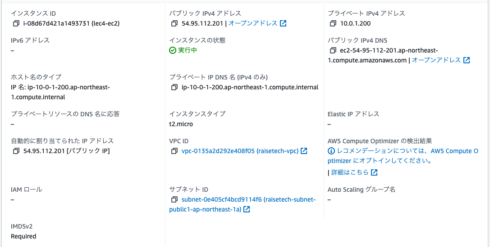  

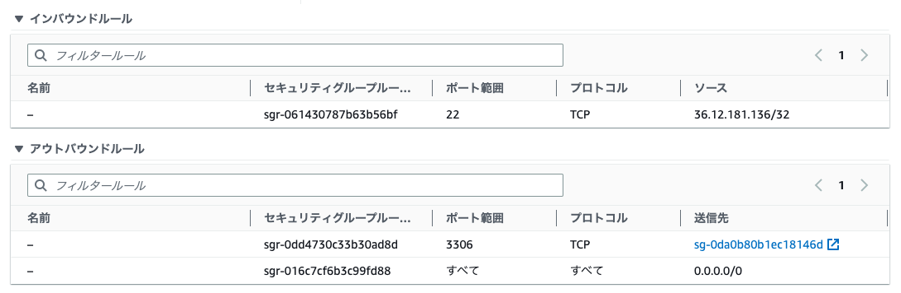  


EC2の作成時に行うこと
+ 名前を設定
+ サーバーのOSを選択(AmazonLinux)
+ キーペアを作成
+ VPCを選択
+ サブネットを選択
+ EC2のセキュリティグループを作成
+ AZを選択
 
 ### RDSを作成
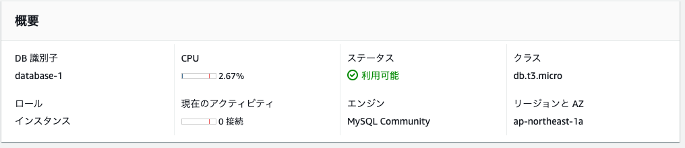  
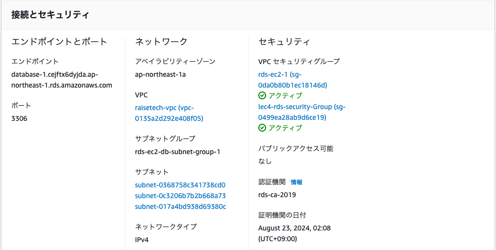  
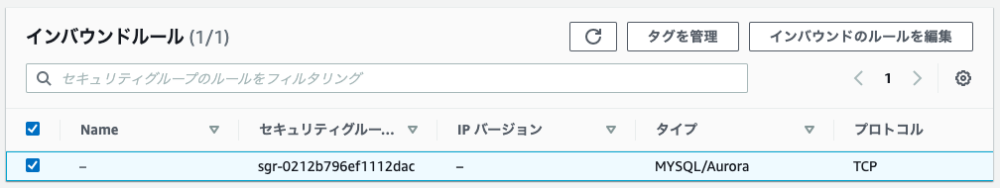  

RDSの作成時に行うこと
+ エンジンのオプションを選択(MySQL)
+ DBのユーザー名とパスワードを設定(admin)
+ ストレージの自動スケーリングをオフにする
+ AZを選択
+ EC2に接続

### SSHでEC2に接続
+ キーペアに読み取り権限のみ付与
```
chmod 400 <キーペア>
```
+ SSHでEC2に接続
```
ssh -i "<キーペア>" ec2-user@<インスタンスのパブリックDNS>
```

### EC2からRDSに接続
+ ダウンロードしたいmysql-communityリポジトリのパッケージを選択する。https://dev.mysql.com/downloads/repo/yum/

    ※バージョンが古い場合、MySQLのインストールの際に「Problem: conflicting requests」のエラーが出る可能性がある
```
sudo yum localinstall https://dev.mysql.com/get/mysql80-community-release-el9-1.noarch.rpm
```
+ MySQLをインストール
```
sudo install -y mysql-community-client
```
+ MySQLに接続
```
# mysql -u <usename> -p -h <RDS接続情報> -P <ポート番号>
$ mysql -u admin -p -h database-1.cejftx6dyjda.ap-northeast-1.rds.amazonaws.com -P 3306
Enter password: 
Welcome to the MySQL monitor.  Commands end with ; or \g.
Your MySQL connection id is 160
Server version: 8.0.32 Source distribution

Copyright (c) 2000, 2023, Oracle and/or its affiliates.

Oracle is a registered trademark of Oracle Corporation and/or its
affiliates. Other names may be trademarks of their respective
owners.

Type 'help;' or '\h' for help. Type '\c' to clear the current input statement.

mysql> 
```
+ 参考リンク

  + [【AmazonLinux2 EC2インスタンス作成後、mysql: コマンドが見つかりません の状態からRDS接続するまで - Qiita](https://qiita.com/takizawafw6o2o/items/0bfc41147ef53ef857f4)

  + [【アップデート】EC2からRDSの自動接続ができるようになりました | SunnyCloud](https://www.sunnycloud.jp/column/20221020-01/)

### 感想
MySQLをインストールするのに手間取った。バージョンが合わなかったのが原因だった。無事インストールし、EC2からRDSの接続確認ができて良かった。今後は今回よりも複雑な構成になると思うので、慣れるように頑張っていきたい。

<script src="https://blz-soft.github.io/md_style/release/v1.2/md_style.js" ></script>