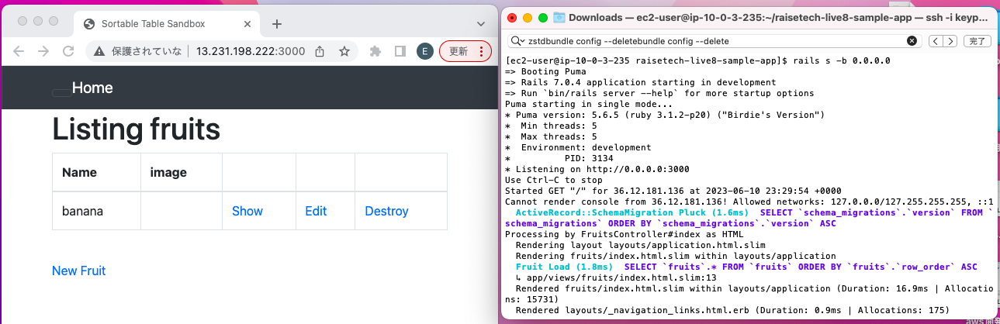
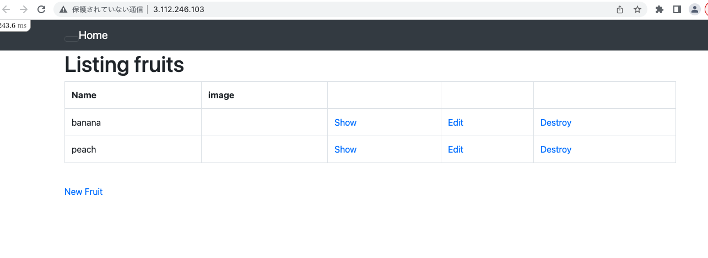
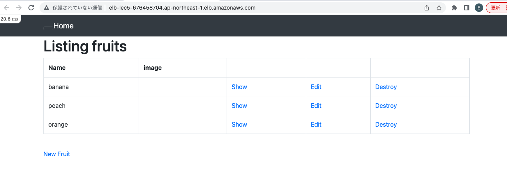
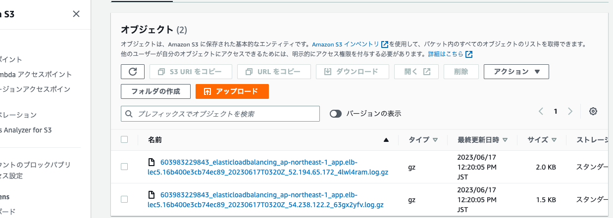
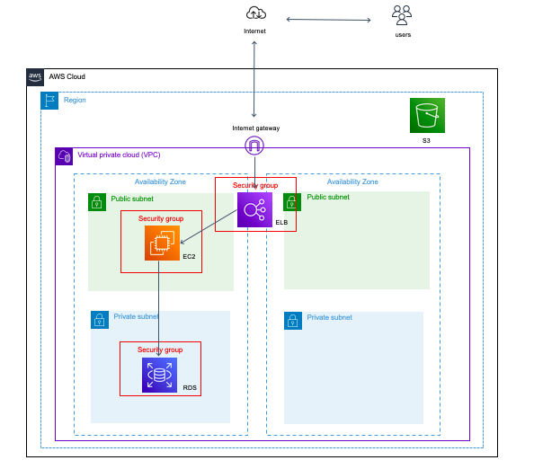

# 第５回課題

## EC2上にサンプルアプリケーションをデプロイして、動作させる

+ 組み込みサーバーだけ動作させる
  

+ Webサーバーとアプリケーションサーバーを分けて動作させる
  

## ELB(ALB)を追加
  

## S3を追加
ALBのアクセスログをS3に保存するように設定。アクセスすると下の図のようにログが保存される。
  

## 構成図に書き起こす
  
