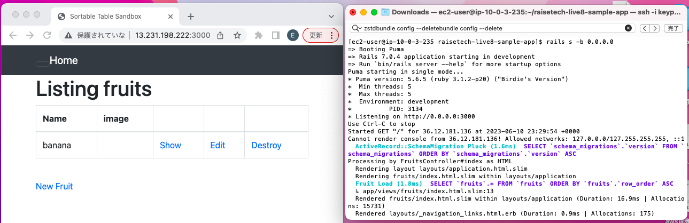
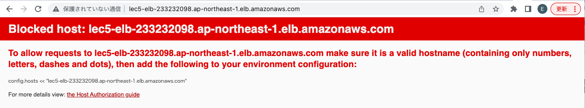

# 第５回課題の手順

## EC2上にサンプルアプリケーションをデプロイして、動作させる
### 組み込みサーバーだけ動作させる

● EC2を作成

● VPCを作成

● RDSを作成

● EC2とRDSを接続

● yumをアップデート
```
sudo yum update -y
```
● gitをインストール
```
sudo yum install git -y
```
gitのバージョン　git version 2.40.1
```
git -v
```
● アプリケーションをクローン
```
git clone https://github.com/yuta-ushijima/raisetech-live8-sample-app.git
```
● アプリケーションのフォルダーに移動
```
cd raisetech-live8-sample-app
```
<br>
次に必要なものをインストールしていく。※1を参照。
インストールの際は、/home/ec2-user/raisetech-live8-sample-appのディレクトリで実行する。

● railsの起動に必要なパッケージをインストール 
```
sudo yum install -y gcc-c++ glibc-headers openssl-devel readline libyaml-devel readline-devel zlib zlib-devel libffi-devel libxml2 libxslt libxml2-devel libxslt-devel sqlite-devel
```
● rbenvのインストール 

rebenvは、rubyのバージョンを管理するツール
```
git clone https://github.com/sstephenson/rbenv.git ~/.rbenv
```
上記でだけではコマンド実行できないのでPATHを設定
```
echo 'export PATH="$HOME/.rbenv/bin:$PATH"' >> ~/.bash_profile
```
```
echo 'eval "$(rbenv init -)"' >> ~/.bash_profile
```
```
source ~/.bash_profile
```
バージョンを確認する  rbenv 1.2.0-64-gaf9201e
```
rbenv -v
```
● ruby-buildのインストール 

ruby-buildはrubyをインストールするためのrbenvプラグイン

~~git clone git://github.com/sstephenson/ruby-build.git ~/.rbenv/plugins/ruby-build~~

上記だとエラーなのでhttpsに変更してgithubからクローン
```
git clone https://github.com/sstephenson/ruby-build.git ~/.rbenv/plugins/ruby-build
cd ~/.rbenv/plugins/ruby-build
```
保存したディレクトリ内にあるinstall.shを実行してインストールする。 ※2
```
cd ~/.rbenv/plugins/ruby-build
```
```
sudo ./install.sh
```
● rubyのインストール 
```
rbenv install -v
```
上記を実行したところ、「No space left on device」というメッセージが出た。

コマンド「df」を実行すると、/tmpが100%になっている。/tmpに移動して、容量が大きいファイルを削除する。ディレクトリパスを削除するときは、
sudo rm -rf ディレクトリパス ※4を実行する。
<br>

容量が足りないので、インスタンスタイプをt2.microからt2.smallに変更する。変更方法については※3を参照。変更後、再度上記を実行してインストールする。

Rubyのバージョンを確認　ruby 3.1.2p20 
```
ruby -v
```

● railsのインストール
```
gem install rails
```

● nvmのインストール

Node.jsが必要なのでnvmをインストールする。nvmとは、rbenvのようなnodeのバージョンを切り替えれるツール。
```
git clone https://github.com/creationix/nvm.git ~/.nvm
```
```
source ~/.nvm/nvm.sh
```
次回から起動時に読み込まれるように .bash_profile を編集する。
```
vi .bash_profile
```
以下を記述
```
if [ -f ~/.nvm/nvm.sh ]; then
     . ~/.nvm/nvm.sh
fi
```
バージョンを確認 0.39.3
```
nvm -v
```
● Node.jsのインストール

Node.js の最新バージョンをインストール ※5
```
nvm install --lts
```
バージョンを確認 v18.16.0
```
node -v
```

● yarnのインストール
```
npm install yarn -g
```
バージョンを確認 1.22.19
```
yarn -v
```

● MySQLのインストール ※6

インスタンス作成初期からインストールされているMariaDB用パッケージを削除する。
```
sudo yum remove mariadb-*
```
ダウンロードしたいパッケージを選択する。https://dev.mysql.com/downloads/repo/yum/
```
sudo yum localinstall https://dev.mysql.com/get/mysql80-community-release-el9-1.noarch.rpm
```
MySQLに必要なパッケージ(mysql-community-server)を取得する。
```
sudo yum install --enablerepo=mysql80-community mysql-community-server
```
MySQLに必要なパッケージ(mysql-community-devel)を取得する。
```
sudo yum install --enablerepo=mysql80-community mysql-community-devel
```
インストールされたMySQLに関係のあるパッケージを確認する。
```
yum list installed | grep mysql
```
mysqldを起動する。
```
sudo systemctl start mysqld 
```
musqldの状態を確認する。
```
systemctl status mysqld.service
```

● bundlerのインストール ※1

bundlerは、gemの依存関係とバージョンを管理するためのgem
```
gem install bundle
```
バージョンを確認 Bundler version 2.3.14
```
bundle -v
```

● DBの作成

DB作成
```
rails db:create
```
socket '/tmp/mysql.sock'がないというエラーが出るので検索
```
grep mysql.sock /etc/my.cnf
```
socket=/var/lib/mysql/mysql.sock<br>

config/database.ymlを修正

```
cp config/database.yml.sample config/database.yml
```
```
vi config/database.yml
```
default: &default<br>
  adapter: mysql2<br>
  encoding: utf8mb4<br>
  pool: <%= ENV.fetch("RAILS_MAX_THREADS") { 5 } %><br>
  username: ****→RDS作成時に設定したusernameを設定<br> 
  password: ****→RDS作成時に設定したpasswordを設定<br>
  host: ****→RDS作成時に設定したエンドポイントを設定<br>

development:<br>
  <<: *default<br>
  database: raisetech_live8_sample_app_development<br>
  socket: /var/lib/mysql/mysql.sock→socketを修正する<br>

test:<br>
  <<: *default<br>
  database: raisetech_live8_sample_app_test<br>
  socket: /var/lib/mysql/mysql.sock→socketを修正する<br>

```
rails db:migrate
```
● EC2のセキュリティグループのインバウンドルールを追加

カスタムTCP,プロトコルTCP,ポート番号3000,ソース0.0.0.0/0を追加する
  


● コンパイル ※7
```
rails assets:precompile
```

● railsを起動する

起動の際は、/home/ec2-user/raisetech-live8-sample-appのディレクトリで実行する。

```
rails s -b 0.0.0.0
```

● サイトにアクセス

「EC2のIPアドレス:3000」にアクセス

  

### Webサーバーとアプリケーションサーバーを分けて動作させる

サーバーにはwebサーバーとアプリケーションサーバーがある。

● webサーバー(Nginx)の設定をする

~~sudo amazon-linux-extras install nginx1~~

上記コマンドを実行するとsudo: amazon-linux-extras: command not foundが出る。原因は今使ってるEC2のバージョンにamazon-linux-extrasが対応してないから。

別の方法でインストール　※8
```
sudo yum install -y nginx
```
バージョンを確認 nginx version: nginx/1.24.0
```
nginx -v
```
EC2のセキュリティグループのインバウンドルールを追加

カスタムTCP,プロトコルHTTP,ポート番号80,ソース0.0.0.0/0を追加する

<br>

Nginxを起動
```
sudo systemctl start nginx
```

<br>
サイトにアクセス

「http://EC2のIPアドレス」にアクセスすると、Nginxの初期状態のページが表示された。

  

/etc/nginx/conf.d/rails.confを新規作成して編集
```
sudo vi /etc/nginx/conf.d/rails.conf
```
```
upstream unicorn {
  server unix:/home/ec2-user/raisetech-live8-sample-app/unicorn.sock;→修正
}

server {
  listen 80;→許可するポート番号
  server_name 52.194.249.60;→EC2のIPアドレス
  root /home/ec2-user/raisetech-live8-sample-app/public;→アプリのルートディレクトリを定義

  location ^~ /assets/ {
    gzip_static on;
    expires max;
    add_header Cache-Control public;
  }

  location @unicorn {
    proxy_set_header X-Forwarded-For $proxy_add_x_forwarded_for;
    proxy_set_header Host $http_host;
    proxy_redirect off;
    proxy_pass http://unicorn;
  }

  try_files $uri/index.html $uri @unicorn;
  error_page 500 502 503 504 /500.html;
}
```


### アプリケーションサーバー(Unicorn)の設定をする

Rails アプリケーションがあるディレクトリの config ディレクトリに unicorn.rb というファイルがある。
/home/ec2-user/raisetech-live8-sample-app/config/unicorn.rb

```
vi config/unicorn.rb
```

listenやpidのパスは、{Railsアプリケーションのあるディレクトリ}/tmp/unicorn.sock(pid)
```
worker_processes Integer(ENV["WEB_CONCURRENCY"] || 3)
timeout 15
preload_app true

listen '/home/ec2-user/raisetech-live8-sample-app/unicorn.sock'
pid    '/home/ec2-user/raisetech-live8-sample-app/unicorn.pid'

before_fork do |server, worker|
  Signal.trap 'TERM' do
    puts 'Unicorn master intercepting TERM and sending myself QUIT instead'
    Process.kill 'QUIT', Process.pid
  end

  defined?(ActiveRecord::Base) and
    ActiveRecord::Base.connection.disconnect!
end

after_fork do |server, worker|
  Signal.trap 'TERM' do
    puts 'Unicorn worker intercepting TERM and doing nothing. Wait for master to send QUIT'
  end

  defined?(ActiveRecord::Base) and
    ActiveRecord::Base.establish_connection
end

stderr_path File.expand_path('log/unicorn.log', ENV['RAILS_ROOT'])
stdout_path File.expand_path('log/unicorn.log', ENV['RAILS_ROOT'])
```

●サーバーを起動してサイトにアクセス

Nginxサーバー再起動
```
sudo systemctl restart nginx
```
Unicornサーバー起動
```
unicorn -c /home/ec2-user/raisetech-live8-sample-app/config/unicorn.rb -E development -D
```

サイト「http://<EC2のIPアドレス>」にアクセスするが、サイトには502のGatewayが出るので、エラーログを確認

Nginxのエラーログを確認
```
sudo vi /var/log/nginx/error.log
```
上記を実行すると、Permission deniedというエラーが出ていることがわかる。

2023/06/22 07:44:32 [crit] 76683#76683: *13 connect() to unix:/home/ec2-user/raisetech-live8-sample-app/unicorn.sock failed (13: Permission denied) while connecting to upstream, client: 3.90.43.97, server: 52.194.249.60, request: "GET / HTTP/1.1", upstream: "http://unix:/home/ec2-user/raisetech-live8-sample-app/unicorn.sock:/", host: "52.194.249.60"

Nginxを立ち上げたユーザーと、Unicornを立ち上げたユーザーが一致しているかを確認したところ、Nginxは「nginx」、Unicornでは「ec2-user」となっているので、Nginxの方を「ec2-user」となるようにする。※9
```
ps aux | grep nginx
```
root       76681  0.0  0.0  29924  1408 ?        Ss   07:19   0:00 nginx: master process /usr/sbin/nginx
nginx      76683  0.0  0.2  41644  4124 ?        S    07:19   0:00 nginx: worker process
ec2-user   77109  0.0  0.0 222312  2000 pts/0    S+   07:29   0:00 grep --color=auto nginx

```
ps aux | grep unicorn
```
ec2-user   77111  0.0  0.1 222312  2004 pts/0    S+   07:30   0:00 grep --color=auto unicorn

Nginxのusernameを「ec2-user」にする
```
sudo vi /etc/nginx/nginx.conf
```
```
user ec2-user;→nginxから変更
worker_processes auto;
error_log /var/log/nginx/error.log notice;
pid /run/nginx.pid;

# Load dynamic modules. See /usr/share/doc/nginx/README.dynamic.
include /usr/share/nginx/modules/*.conf;

events {
    worker_connections 1024;
}

http {
    log_format  main  '$remote_addr - $remote_user [$time_local] "$request" '
                      '$status $body_bytes_sent "$http_referer" '
                      '"$http_user_agent" "$http_x_forwarded_for"';

    access_log  /var/log/nginx/access.log  main;

    sendfile            on;
    tcp_nopush          on;
    keepalive_timeout   65;
    types_hash_max_size 4096;

    include             /etc/nginx/mime.types;
    default_type        application/octet-stream;

    # Load modular configuration files from the /etc/nginx/conf.d directory.
    # See http://nginx.org/en/docs/ngx_core_module.html#include
    # for more information.
    include /etc/nginx/conf.d/*.conf;

    server {
        listen       80;
        listen       [::]:80;
        server_name  _;
        root         /usr/share/nginx/html;

        # Load configuration files for the default server block.
        include /etc/nginx/default.d/*.conf;

        error_page 404 /404.html;
        location = /404.html {
        }

        error_page 500 502 503 504 /50x.html;
        location = /50x.html {
        }
    }
}
```

Unicornのログを確認
```
vi log/unicorn.log
```
[2023-06-22T07:59:38.461696 #78209]  INFO -- : Refreshing Gem list
/home/ec2-user/.rbenv/versions/3.1.2/lib/ruby/gems/3.1.0/gems/bundler-2.3.14/lib/bundler/runtime.rb:309:in `check_for_activated_spec!': You have already activated rack 2.2.7
, but your Gemfile requires rack 2.2.6.4. Prepending `bundle exec` to your command may solve this. (Gem::LoadError)

bundle execをつけて実行する。※10
```
bundle exec unicorn -c /home/ec2-user/raisetech-live8-sample-app/config/unicorn.rb -E development -D
```
再度サイトにアクセスすると、アクセスはできたが、jsやcssファイルが読み込めてない状況

  

Nginxのエラーログで見てもjsに関するエラーだった
```
sudo vi /var/log/nginx/error.log
```
2023/06/22 08:04:34 [error] 78170#78170: *2 open() "/home/ec2-user/raisetech-live8-sample-app/public/assets/application.debug-045d6c1e62258d4ae7078d64799062276abf5d227a8851f9495ee72f0681f7ba.css" failed (2: No such file or directory), client: 36.12.181.136, server: 52.194.249.60, request: "GET /assets/application.debug-045d6c1e62258d4ae7078d64799062276abf5d227a8851f9495ee72f0681f7ba.css HTTP/1.1", host: "52.194.249.60", referrer: "http://52.194.249.60/"

```
vi config/environments/development.rb
```
config.assets.debug = false に変更。


再度アクセスしたら、jsやcssが反映された。

  

## ELB(ALB)を追加
● ELBを作成 ※12
  + VPCを選択

  + ELBのセキュリティーグループを作成（インバウンドルールは、タイプはHTTP,ポート番号80、ソースは0.0.0.0/0)

  + 負荷を分散させる先である「ターゲットグループ」を作成する。負荷分散先はEC2。※11

● ELBのDNS Nameにアクセス

DNS Name: lec5-elb-233232098.ap-northeast-1.elb.amazonaws.com

config/environments/development.rbにconfig.hosts << "<許可したいホスト名>"を記載する。※13

  

再度アクセスすると表示された。

  


## S3を追加

ALBのアクセスログをS3に保存するようにする。

S3を作成 ※15

先ほど作成したELBのアクセスログをOnに変更する。その際に、先ほど作成したS3をアクセスログの保存先に指定する。Access Deniedになったので、S3のポケットポリシーを作成する。

S3のポケットポリシー
```
{
    "Version": "2012-10-17",
    "Statement": [
        {
            "Effect": "Allow",
            "Principal": {
                "AWS": "arn:aws:iam::582318560864:root"
            },
            "Action": "s3:PutObject",
            "Resource": "arn:aws:s3:::lec5-s3/*"
        }
    ]
}
```

バケットのバージョニングを有効にしとく（任意）

  


サイトにアクセスすると、ログがS3に保存される。

  


## 参考リンク
+ [EC2 + Nginx + Unicorn + Mysql よく使うコマンドまとめ - Qiita](https://qiita.com/yanakou/items/6572c242f2f8455aa2df) :Nginx + Unicornで使うコマンド

+ [unicornの操作方法 - Qiita](https://qiita.com/suesan/items/2893364c269faff379e6) :Unicornで使うコマンド

+ [AWS EC2 | Ruby on Rails インストール手順 – 修ちゃんの技術資料](https://prettytabby.com/ec2-ruby-install/) : ※1
+ [EC2にrubyをインストールする手順 ~rbenvからbundlerの解説~ | HITOログ](https://hitolog.blog/2021/10/13/how-to-ruby-install/) : ※2
+ [AWS EC2のインスタンスタイプ変更手順](https://bsblog.casareal.co.jp/archives/4725) : ※3
+ [Error:「No space left on device」が表示された時の原因と対処法 – Linux/Mac](https://itojisan.xyz/trouble/15772/#2) : ※4
+ [チュートリアル: Amazon EC2 インスタンスでの Node.js のセットアップ - AWS SDK for JavaScript](https://docs.aws.amazon.com/ja_jp/sdk-for-javascript/v2/developer-guide/setting-up-node-on-ec2-instance.html) : ※5
+ [AWS EC2 AmazonLinux2 MySQLをインストールする - Qiita](https://qiita.com/miriwo/items/eb09c065ee9bb7e8fe06) : ※6
+ [【Ruby on Rails】アセットパイプラインについて | プログラミングマガジン](http://www.code-magagine.com/?p=7855) : ※7

+ [【Rails5をNginx経由で接続させるためのNginxの設定。Nginx＋Puma＋Rails5 - エンジニアのメモ](https://koooza.net/post-382#st-toc-h-4) : ※8

+ [【aws nginx + unicorn (13:permission dnined) while connecting to upstream でハマッた時に試したことのTIPS - Qiita](https://qiita.com/UltraBirdTech/items/4f1a4a490cfc19298ad0) : ※9

+ [ruby rakeコマンド実行時に「Gem::LoadError: You have already activated rake xx.xx.xx, but your Gemfile requires rake xx.xx.xx. Prepending bundle exec to your command may solve this」が発生した場合の対処法 | mebee](https://mebee.info/2020/07/20/post-13846/) : ※10

+ [【保存版】AWS Application Load Balancer（ALB）を使ってEC2にアクセスしてみよう！｜ユウキ](https://note.com/standenglish/n/n0bdd964c308f) : ※11

+ [ELB（Elastic Load Balancing）を調べて使ってみた。 | DevelopersIO](https://dev.classmethod.jp/articles/elb-explanation-try/) : ※12

+ [Rails6の本番環境でBlocked hostエラーが発生したときの対処法 - Qiita](https://qiita.com/kodai_0122/items/67c6d390f18698950440) : ※13

+ [ALBのアクセスログを有効にする際、Access Deniedになった時にS3バケットで確認するポイント | DevelopersIO](https://dev.classmethod.jp/articles/alb-access-log-permission-error-s3-bucket/) : ※14

+ [ALBのアクセスログをS3に保存して中身を読み解いてみる | DevelopersIO](https://dev.classmethod.jp/articles/alb-log-to-s3/) : ※15

<script src="https://blz-soft.github.io/md_style/release/v1.2/md_style.js" ></script>