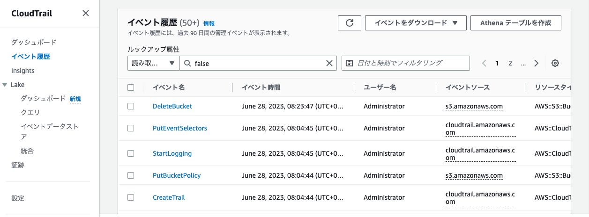
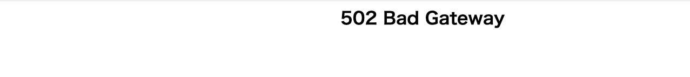
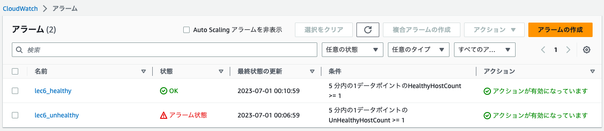
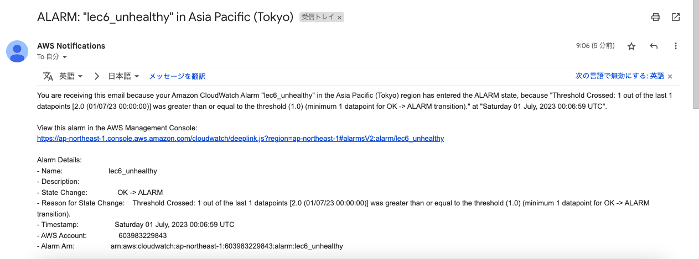
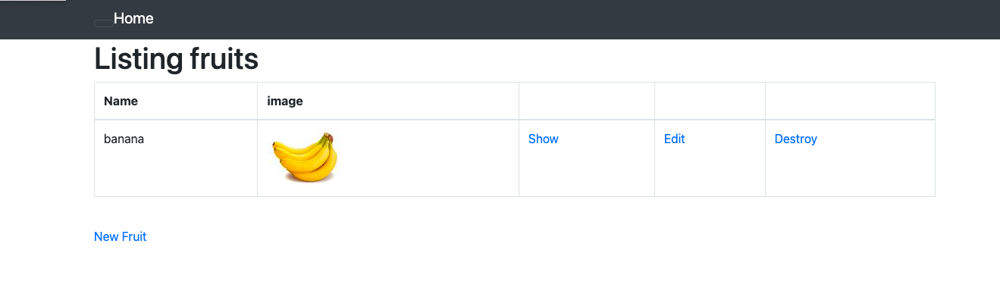
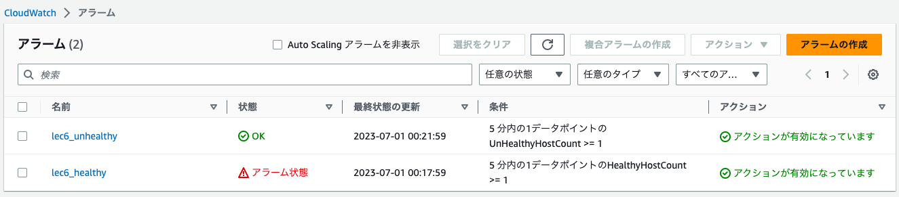
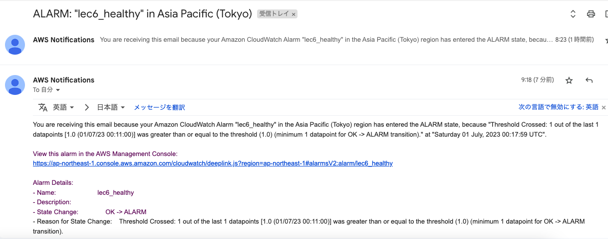
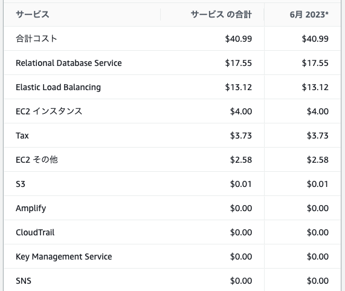

# 第6回課題

## CloudTrail イベントの記録 

最後にAWSを利用した日の記録をCloudTrailのイベントから探し出す。イベント履歴から S3に入っているデータを削除した記録があった。記録内容は以下の通り。

+ イベント名：DeleteBucket

+ イベント時間：June 28, 2023, 08:23:47 (UTC+09:00)

+ イベントソース：s3.amazonaws.com

+ AWS リージョン：ap-northeast-1

  

## CloudWatch アラーム
### アラームとアクションを設定する

1. アラームの作成
2. メトリクスの選択
3. 「ApplicationELB」を選択
4. 「AppELB別,TG別メトリクス」を選択
5. Healtyの状態を検知する場合は、HealthyHostCount、Unhealtyの状態を検知する場合は、UnHealthyHostCountを選択する。
6. TargetGroupがALBで設定したIDと同じか確認する。
7. Healtyの状態を検知する場合は、5分でHealthyHostCountを1以上検知したらアラーム出すようにする。UnHealtyの状態を検知する場合は、5分でUnHealthyHostCountを1以上検知したらアラーム出すようにする。
8. 通知先をAmazon SNS を使って、メールで通知するようにする。

### Rails アプリケーションが使えない状態のとき

アプリケーションが使えない状態は、以下のようになっている。
  

Unhealtyのアラームが出ている。
  

下のようなメールが届く
  

### Rails アプリケーションが使える状態の時

アプリケーションが使える状態は、以下のようになっている。
  

healtyのアラームが出ている。
  

下のようなメールが届く
  

## AWS 利用料の見積を作成

今日までに作成したリソースの内容を見積もる。

見積もりのURLは以下のリンク。

https://calculator.aws/#/estimate?id=f9a0503b61be14fb455f6d9e2d319bd53820c758

## マネジメントコンソールから、現在の利用料を確認

無料利用枠の期限は切れているので収まってない。
先月のEC2 の料金は$4.00だった。

  

## 参考リンク
  + [AWS CloudTrail - Qiita](https://qiita.com/leomaro7/items/c1457699c96d08adfc33) : CloudTrail
  +  [【ざっくり解説】ELBのCloudWatchによるモニタリング｜AWS SysOps Administrator Associate（SOA） | 在宅カエルのブログ](https://zaitakufrog-blog.com/aws-elb-monitoring/) : CloudWatch
   +  [AWS料金の見積方法とAWS Pricing Calculatorの使い方 | TOKAIコミュニケーションズ AWSソリューション](https://www.cloudsolution.tokai-com.co.jp/white-paper/2021/1201-274.html) : AWS利用料金見積もり