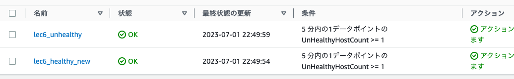
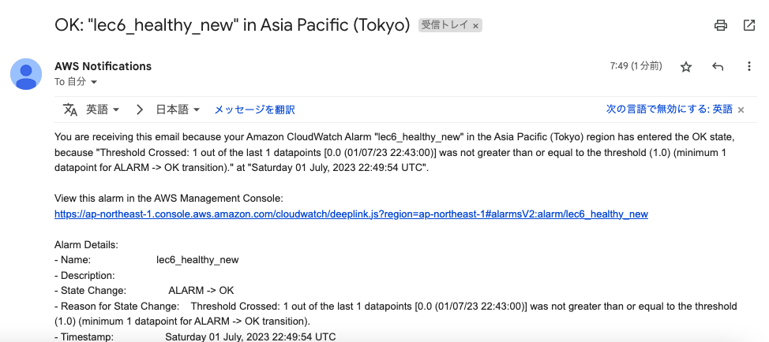

# 第6回課題

## CloudTrail イベントの記録 

最後にAWSを利用した日の記録をCloudTrailのイベントから探し出す。イベント履歴から S3に入っているデータを削除した記録があった。記録内容は以下の通り。

+ イベント名：DeleteBucket

+ イベント時間：June 28, 2023, 08:23:47 (UTC+09:00)

+ イベントソース：s3.amazonaws.com

+ AWS リージョン：ap-northeast-1

  

## CloudWatch アラーム
### アラームとアクションを設定する

1. アラームの作成
2. メトリクスの選択
3. 「ApplicationELB」を選択
4. 「AppELB別,TG別メトリクス」を選択
5. Unhealtyの状態を検知する場合は、UnHealthyHostCountを選択する。
6. TargetGroupがALBで設定したIDと同じか確認する。
7. UnHealtyの状態を検知する場合は、5分でUnHealthyHostCountを1以上検知したらアラーム出すようにする。
8. アラーム状態のトリガーを選択する。アプリケーションが使えない状態の時に通知するのは「アラーム状態」、使える状態の時に通知するのは「OK」。
9. 通知先をAmazon SNS を使って、メールで通知するようにする。

### Rails アプリケーションが使えない状態のとき

アプリケーションが使えない状態は、以下のようになっている。
  

Unhealtyのアラームが出ている。(名前lec6_unhealthy)
  

下のようなメールが届く
  

### Rails アプリケーションが使える状態の時

アプリケーションが使える状態は、以下のようになっている。
  

OKが出ている。(名前lec6_healthy_new)
  

下のようなメールが届く
  

<!-- 
healtyのアラームが出ている。
  

下のようなメールが届く
  
-->

## AWS 利用料の見積を作成

今日までに作成したリソースの内容を見積もる。

見積もりのURLは以下のリンク。

https://calculator.aws/#/estimate?id=d170457f699c99f345d7222f09e50ba9d27c6220

## マネジメントコンソールから、現在の利用料を確認

無料利用枠の期限は切れているので収まってない。
先月のEC2 の料金は$4.00だった。

  

## 参考リンク
  + [AWS CloudTrail - Qiita](https://qiita.com/leomaro7/items/c1457699c96d08adfc33) : CloudTrail
  +  [【ざっくり解説】ELBのCloudWatchによるモニタリング｜AWS SysOps Administrator Associate（SOA） | 在宅カエルのブログ](https://zaitakufrog-blog.com/aws-elb-monitoring/) : CloudWatch
   +  [AWS CloudWatchでロードバランサーのターゲットがアンヘルシーになった時に通知する | IT王子の技術ブログ](https://it-ouji.com/2021/02/17/aws-cloudwatch%E3%81%A7%E3%83%AD%E3%83%BC%E3%83%89%E3%83%90%E3%83%A9%E3%83%B3%E3%82%B5%E3%83%BC%E3%81%AE%E3%82%BF%E3%83%BC%E3%82%B2%E3%83%83%E3%83%88%E3%81%8C%E3%82%A2%E3%83%B3%E3%83%98%E3%83%AB/) : OKアクション
   +  [AWS料金の見積方法とAWS Pricing Calculatorの使い方 | TOKAIコミュニケーションズ AWSソリューション](https://www.cloudsolution.tokai-com.co.jp/white-paper/2021/1201-274.html) : AWS利用料金見積もり

   +  [AWS Pricing Calculaterのススメ | BTC Cloud](https://cloud.bigtreetc.com/column/how-to-use-aws-pricing-calculater/) : ELB料金の見積もり