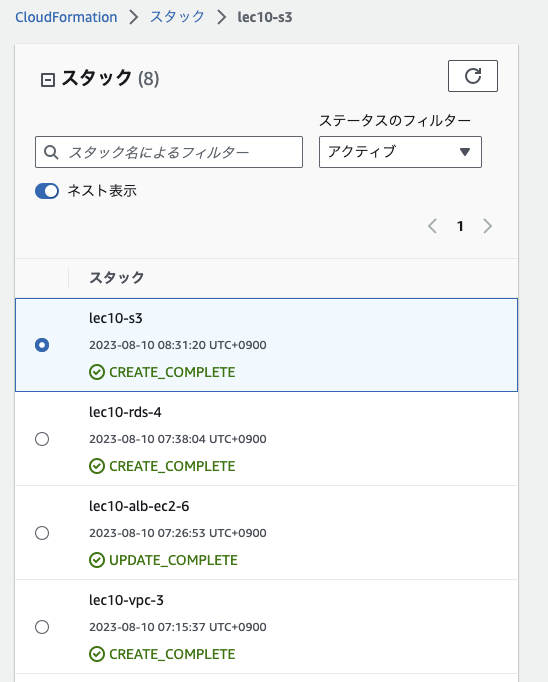
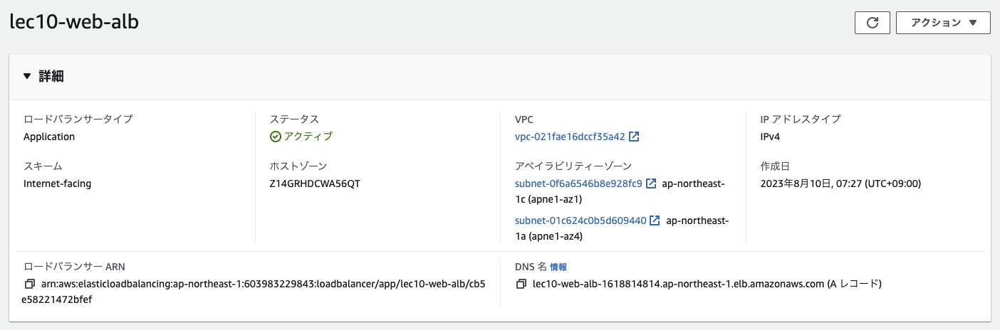
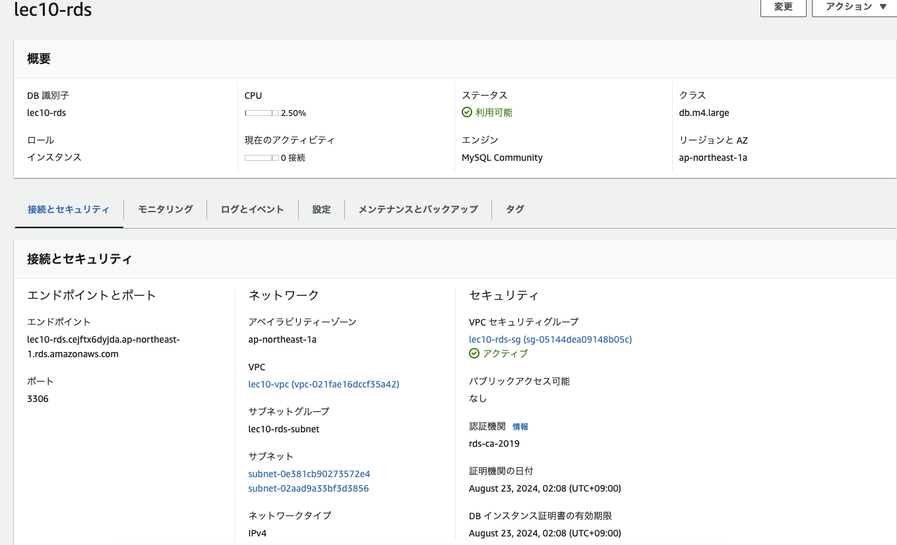
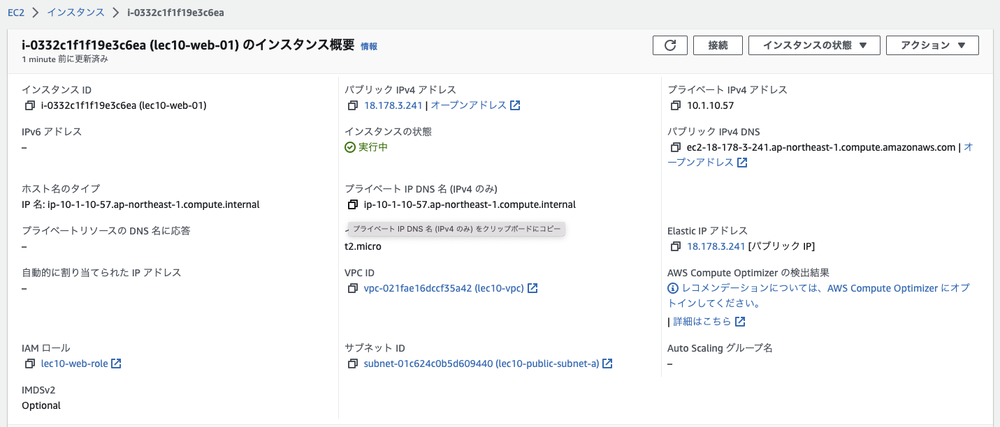
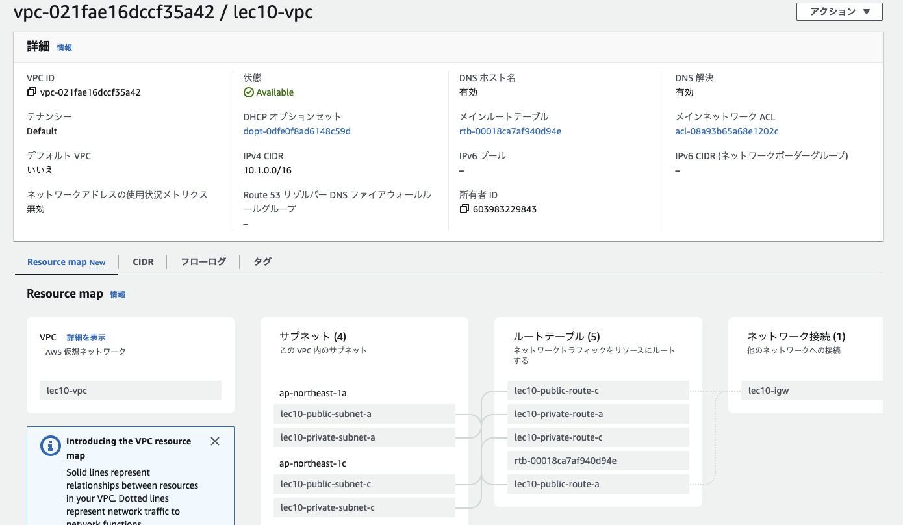
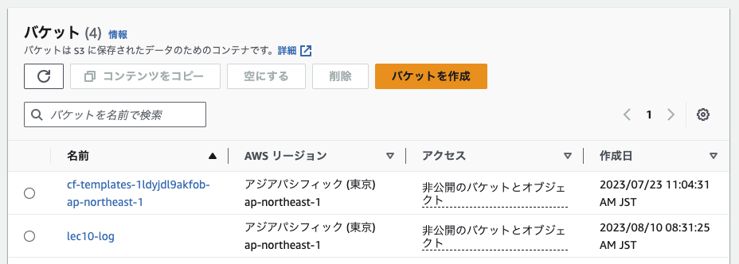

# 第10回課題
CloudFormation を利用して、現在までに作った環境をコード化する。

+ Cloudformationで作成したスタック
  

+ ALB
  

+ RDS
  

+ EC2
  

+ VPC
  

+ S3
  

## 感想
コードで環境が自動構築されるので便利だと思った。パラメータを設定したり、他のスタックに値を受け渡したりなどできることがわかった。

## 参考リンク

+ [CloudFormationテンプレート間で値を渡す3つの方法 - Qiita](https://qiita.com/tiibun/items/67aa74cdc17bc0b9812c):※1 ImportValue

+ [SecurityGroupルールのCidrIpの省略と !Ref "AWS::NoValue" と "0.0.0.0/0" - Qiita](https://qiita.com/tsukamoto/items/fff3d7c58d24eb08034c):※2 SecurityGroup

+ [【AWS】 CloudFormationで基本的なシングル構成を自動構築する](https://zenn.dev/megazone_japan/articles/ad61f0dbc6e37f):※3 ec2

+ [CloudFormationによる【RDS】の構築 - 協栄情報ブログ](https://cloud5.jp/cf-rds/):※4 rds

+ [CloudFormation備忘録 - Qiita](https://qiita.com/ej2kd/items/ed17c0f3109590f1d33f):※5 rds

+ [CloudFormationでELBの構築 - Qiita](https://qiita.com/toyoyuto618/items/05bfb0ca2fbe14207274):※6 elb

+ [iDATEN(韋駄天)｜ AWS 第7回『やってみようシリーズ：仮想ネットワークを作ってみよう「VPCの作成中にエラーが発生しました」編』](https://www.idaten.ne.jp/portal/page/out/secolumn/multicloud/column014.html): Resource handler returned message: "The maximum number of internet gateways has been reached

+ [AWS CloudFormationでEC2キーペアを作成する - Qiita](https://qiita.com/tsukamoto/items/1e0f3c8ecf4cba5cf485):※7 KeyPair

+ [CloudFormationでいろいろなS3バケットを作成してみた | DevelopersIO](https://dev.classmethod.jp/articles/cloudformation-s3bucket-type/):※8 D3

+ [aws-cloudformation/s3-cloudfront-sorry.yml at master · okubo-t/aws-cloudformation · GitHub](https://github.com/okubo-t/aws-cloudformation/blob/master/s3-cloudfront-sorry.yml):※9

+ [CloudFormationを使ってALBとEC2 (１台)を構築する - Qiita](https://qiita.com/okubot55/items/844ae5ac5b188435d58b):※10

