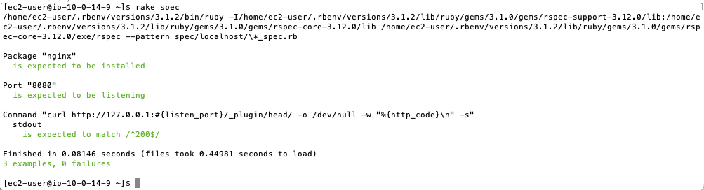

# 第11回課題

## Serverspecをインストール

1. SSHでEC2に接続

2. テストに必要なものを準備。今回はRailsアプリを起動できるところまで準備。

3. Serverspecをインストール
```
gem install serverspec
```


4. Serverspecの初期設定
```
serverspec-init
```
Select OS type:
  1) UN*X
  2) Windows
Select number: 1
Select a backend type:
  1) SSH
  2) Exec (local)
Select number: 2
 + spec/
 + spec/localhost/
 + spec/localhost/sample_spec.rb
 + spec/spec_helper.rb
 + Rakefile
 + .rspec

5. ディレクトリー移動
```
cd spec/localhost
```

6. テスト情報を記入。
```
vi sample_spec.rb
```

```
require 'spec_helper'

listen_port = 8080

describe package('nginx') do
  it { should be_installed }
end

describe port(listen_port) do
  it { should be_listening }
end

describe command('curl http://127.0.0.1:#{listen_port}/_plugin/head/ -o /dev/null -w "%{http_code}\n" -s') do
  its(:stdout) { should match /^200$/ }
end
```
7. テストを実行
```
rake spec
``` 
  