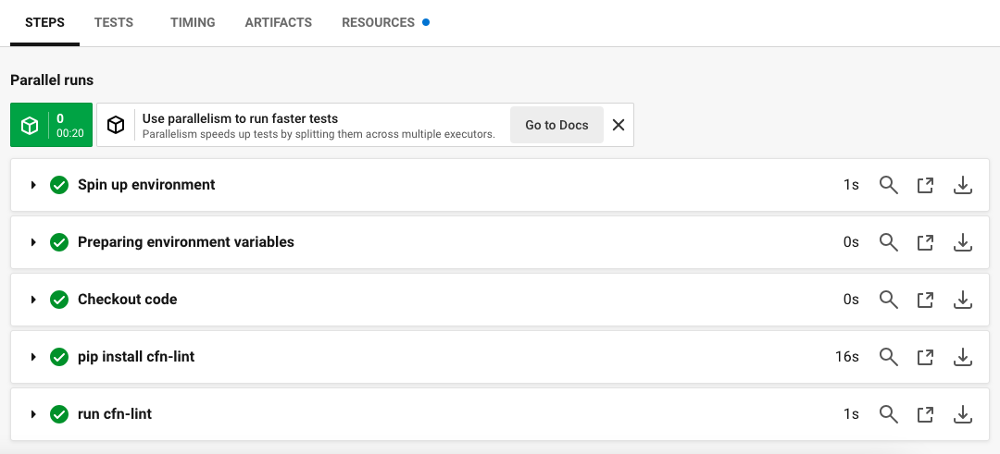

# 第12回課題の手順

## CircleCIとリポジトリの連携方法　
※1を参照
1. CircleCIのユーザー登録をする。今回はGithubで登録する。
[Githubで登録](https://circleci.com/vcs-authorize/?error=vcs-connect-logged-out)
[ユーザー登録の説明](https://circleci.com/docs/first-steps/)

2. CircleCIと連携するGithubのリポジトリを作成する。今回のリポジトリの名前はcircleci-studyにする。
  

3. プロジェクトを選択する。リポジトリは2で作成したリポジトリを選択する。
 

## CircleCIでHello Worldを表示する手順
※1を参照
1. config.ymlを選択する。今回はサンプル設定ファイルの Hello World を選択。config.ymlの中身は下記。
```
# Use the latest 2.1 version of CircleCI pipeline process engine.
# See: https://circleci.com/docs/configuration-reference
version: 2.1

# Define a job to be invoked later in a workflow.
# See: https://circleci.com/docs/configuration-reference/#jobs
jobs:
  say-hello:
    # Specify the execution environment. You can specify an image from Docker Hub or use one of our convenience images from CircleCI's Developer Hub.
    # See: https://circleci.com/docs/configuration-reference/#executor-job
    docker:
      - image: cimg/base:stable
    # Add steps to the job
    # See: https://circleci.com/docs/configuration-reference/#steps
    steps:
      - checkout
      - run:
          name: "Say hello"
          command: "echo Hello, World!"

# Orchestrate jobs using workflows
# See: https://circleci.com/docs/configuration-reference/#workflows
workflows:
  say-hello-workflow:
    jobs:
      - say-hello
```
2. config.ymlをコミットして実行をクリックする。今回の場合、circleci-project-setupという新しいブランチで、これは .circleci/config.ymlをコミットして実行する。

3.「Hello, World!」と表示されて実行成功。
 

## 課題12の手順
CircleCIで、cloudformationディレクトリ内のymlファイルをチェックする。

1. 先ほど選択したconfig.ymlを、今回課題で提供されたconfig.ymlに置き換える。中身は下記。
```
version: 2.1
orbs:
  python: circleci/python@2.0.3
jobs:
  cfn-lint:
    executor: python/default
    steps:
      - checkout
      - run: pip install cfn-lint
      - run:
          name: run cfn-lint
          command: |
            cfn-lint -i W3002 -t cloudformation/*.yml

workflows:
  raisetech:
    jobs:
      - cfn-lint
```

2. GithubでCloudformationフォルダを作成し、その下にvpc.ymlを置く。中身は下記。
```
AWSTemplateFormatVersion: "2010-09-09"
Description: 
  VPC and Subnet Create

Metadata: 
  "AWS::CloudFormation::Interface": 
    ParameterGroups: 
      - Label: 
          default: "Project Name Prefix"
        Parameters: 
          - PJPrefix
      - Label: 
          default: "Network Configuration"
        Parameters: 
          - VPCCIDR
          - PublicSubnetACIDR
          - PublicSubnetCCIDR
          - PrivateSubnetACIDR
          - PrivateSubnetCCIDR
    ParameterLabels: 
      VPCCIDR: 
        default: "VPC CIDR"
      PublicSubnetACIDR: 
        default: "PublicSubnetA CIDR"
      PublicSubnetCCIDR: 
        default: "PublicSubnetC CIDR"
      PrivateSubnetACIDR: 
        default: "PrivateSubnetA CIDR"
      PrivateSubnetCCIDR: 
        default: "PrivateSubnetC CIDR"

# ------------------------------------------------------------#
# Input Parameters
# ------------------------------------------------------------# 
Parameters:
  PJPrefix:
    Type: String

  VPCCIDR:
    Type: String
    Default: "10.1.0.0/16"

  PublicSubnetACIDR:
    Type: String
    Default: "10.1.10.0/24"

  PublicSubnetCCIDR:
    Type: String
    Default: "10.1.20.0/24"

  PrivateSubnetACIDR:
    Type: String
    Default: "10.1.100.0/24"

  PrivateSubnetCCIDR:
    Type: String
    Default: "10.1.200.0/24"

Resources: 
# ------------------------------------------------------------#
#  VPC
# ------------------------------------------------------------#
# VPC Create
  VPC: 
    Type: "AWS::EC2::VPC"
    Properties: 
      CidrBlock: !Ref VPCCIDR
      EnableDnsSupport: "true"
      EnableDnsHostnames: "true"
      InstanceTenancy: default
      Tags: 
        - Key: Name
          Value: !Sub "${PJPrefix}-vpc"

# InternetGateway Create
  InternetGateway: 
    Type: "AWS::EC2::InternetGateway"
    Properties: 
      Tags: 
        - Key: Name
          Value: !Sub "${PJPrefix}-igw"

# IGW Attach
  InternetGatewayAttachment: 
    Type: "AWS::EC2::VPCGatewayAttachment"
    Properties: 
      InternetGatewayId: !Ref InternetGateway
      VpcId: !Ref VPC 

# ------------------------------------------------------------#
#  Subnet
# ------------------------------------------------------------#          
# Public SubnetA Create
  PublicSubnetA: 
    Type: "AWS::EC2::Subnet"
    Properties: 
      AvailabilityZone: "ap-northeast-1a"
      CidrBlock: !Ref PublicSubnetACIDR
      VpcId: !Ref VPC 
      Tags: 
        - Key: Name
          Value: !Sub "${PJPrefix}-public-subnet-a"

# Public SubnetC Create
  PublicSubnetC: 
    Type: "AWS::EC2::Subnet"
    Properties: 
      AvailabilityZone: "ap-northeast-1c"
      CidrBlock: !Ref PublicSubnetCCIDR
      VpcId: !Ref VPC 
      Tags: 
        - Key: Name
          Value: !Sub "${PJPrefix}-public-subnet-c"
                    
# Private SubnetA Create
  PrivateSubnetA: 
    Type: "AWS::EC2::Subnet"
    Properties: 
      AvailabilityZone: "ap-northeast-1a"
      CidrBlock: !Ref PrivateSubnetACIDR
      VpcId: !Ref VPC 
      Tags: 
        - Key: Name
          Value: !Sub "${PJPrefix}-private-subnet-a"

# Private SubnetC Create
  PrivateSubnetC: 
    Type: "AWS::EC2::Subnet"
    Properties: 
      AvailabilityZone: "ap-northeast-1c"
      CidrBlock: !Ref PrivateSubnetCCIDR
      VpcId: !Ref VPC 
      Tags: 
        - Key: Name
          Value: !Sub "${PJPrefix}-private-subnet-c"
                    
# ------------------------------------------------------------#
#  RouteTable
# ------------------------------------------------------------#          
# Public RouteTableA Create
  PublicRouteTableA: 
    Type: "AWS::EC2::RouteTable"
    Properties: 
      VpcId: !Ref VPC 
      Tags: 
        - Key: Name
          Value: !Sub "${PJPrefix}-public-route-a"
          
# Public RouteTableC Create
  PublicRouteTableC: 
    Type: "AWS::EC2::RouteTable"
    Properties: 
      VpcId: !Ref VPC 
      Tags: 
        - Key: Name
          Value: !Sub "${PJPrefix}-public-route-c"

# Private RouteTableA Create
  PrivateRouteTableA: 
    Type: "AWS::EC2::RouteTable"
    Properties: 
      VpcId: !Ref VPC 
      Tags: 
        - Key: Name
          Value: !Sub "${PJPrefix}-private-route-a"

# Private RouteTableC Create
  PrivateRouteTableC: 
    Type: "AWS::EC2::RouteTable"
    Properties: 
      VpcId: !Ref VPC 
      Tags: 
        - Key: Name
          Value: !Sub "${PJPrefix}-private-route-c"

# ------------------------------------------------------------#
# Routing
# ------------------------------------------------------------# 
# PublicRouteA Create
  PublicRouteA: 
    Type: "AWS::EC2::Route"
    Properties: 
      RouteTableId: !Ref PublicRouteTableA 
      DestinationCidrBlock: "0.0.0.0/0"
      GatewayId: !Ref InternetGateway 

# PublicRouteC Create
  PublicRouteC: 
    Type: "AWS::EC2::Route"
    Properties: 
      RouteTableId: !Ref PublicRouteTableC 
      DestinationCidrBlock: "0.0.0.0/0"
      GatewayId: !Ref InternetGateway 

# ------------------------------------------------------------#
# RouteTable Associate
# ------------------------------------------------------------# 
# PublicRouteTable Associate SubnetA
  PublicSubnetARouteTableAssociation: 
    Type: "AWS::EC2::SubnetRouteTableAssociation"
    Properties: 
      SubnetId: !Ref PublicSubnetA 
      RouteTableId: !Ref PublicRouteTableA

# PublicRouteTable Associate SubnetC
  PublicSubnetCRouteTableAssociation: 
    Type: "AWS::EC2::SubnetRouteTableAssociation"
    Properties: 
      SubnetId: !Ref PublicSubnetC 
      RouteTableId: !Ref PublicRouteTableC
                
# PrivateRouteTable Associate SubnetA
  PrivateSubnetARouteTableAssociation: 
    Type: "AWS::EC2::SubnetRouteTableAssociation"
    Properties: 
      SubnetId: !Ref PrivateSubnetA
      RouteTableId: !Ref PrivateRouteTableA 

# PrivateRouteTable Associate SubnetC
  PrivateSubnetCRouteTableAssociation: 
    Type: "AWS::EC2::SubnetRouteTableAssociation"
    Properties: 
      SubnetId: !Ref PrivateSubnetC
      RouteTableId: !Ref PrivateRouteTableC

# ------------------------------------------------------------#
# Output Parameters
# ------------------------------------------------------------#                
Outputs:
# VPC
  VPC:
    Value: !Ref VPC
    Export:
      Name: !Sub "${PJPrefix}-vpc"

  VPCCIDR:
    Value: !Ref VPCCIDR
    Export:
      Name: !Sub "${PJPrefix}-vpc-cidr"

# Subnet
  PublicSubnetA:
    Value: !Ref PublicSubnetA
    Export:
      Name: !Sub "${PJPrefix}-public-subnet-a"

  PublicSubnetACIDR:
    Value: !Ref PublicSubnetACIDR
    Export:
      Name: !Sub "${PJPrefix}-public-subnet-a-cidr"

  PublicSubnetC:
    Value: !Ref PublicSubnetC
    Export:
      Name: !Sub "${PJPrefix}-public-subnet-c"

  PublicSubnetCCIDR:
    Value: !Ref PublicSubnetCCIDR
    Export:
      Name: !Sub "${PJPrefix}-public-subnet-c-cidr"

  PrivateSubnetA:
    Value: !Ref PrivateSubnetA
    Export:
      Name: !Sub "${PJPrefix}-private-subnet-a"
    
  PrivateSubnetACIDR:
    Value: !Ref PrivateSubnetACIDR
    Export:
      Name: !Sub "${PJPrefix}-private-subnet-a-cidr"

  PrivateSubnetC:
    Value: !Ref PrivateSubnetC
    Export:
      Name: !Sub "${PJPrefix}-private-subnet-c"

  PrivateSubnetCCIDR:
    Value: !Ref PrivateSubnetCCIDR
    Export:
      Name: !Sub "${PJPrefix}-private-subnet-c-cidr"

# Route
  PublicRouteTableA:
    Value: !Ref PublicRouteTableA
    Export:
      Name: !Sub "${PJPrefix}-public-route-a"

  PublicRouteTableC:
    Value: !Ref PublicRouteTableC
    Export:
      Name: !Sub "${PJPrefix}-public-route-c"

  PrivateRouteTableA:
    Value: !Ref PrivateRouteTableA
    Export:
      Name: !Sub "${PJPrefix}-private-route-a"

  PrivateRouteTableC:
    Value: !Ref PrivateRouteTableC
    Export:
      Name: !Sub "${PJPrefix}-private-route-c"

```

3. 現時点でのファイル構成は下の画像。
  

4. 先ほど修正、アップロードしたファイルconfig.yml、vpc.ymlをコミットして実行をクリックする。

5. 実行の結果エラー。下の画像はエラーの画面。
  
エラーの原因は、AZをハードコードしていること※2。下のように修正。

     修正前：AvailabilityZone: ap-northeast-1a　

    修正後：AvailabilityZone: !Sub ${AWS::Region}a　
    
    vpc.ymlの修正後の中身は下記。

```
AWSTemplateFormatVersion: "2010-09-09"
Description: 
  VPC and Subnet Create

Metadata: 
  "AWS::CloudFormation::Interface": 
    ParameterGroups: 
      - Label: 
          default: "Project Name Prefix"
        Parameters: 
          - PJPrefix
      - Label: 
          default: "Network Configuration"
        Parameters: 
          - VPCCIDR
          - PublicSubnetACIDR
          - PublicSubnetCCIDR
          - PrivateSubnetACIDR
          - PrivateSubnetCCIDR
    ParameterLabels: 
      VPCCIDR: 
        default: "VPC CIDR"
      PublicSubnetACIDR: 
        default: "PublicSubnetA CIDR"
      PublicSubnetCCIDR: 
        default: "PublicSubnetC CIDR"
      PrivateSubnetACIDR: 
        default: "PrivateSubnetA CIDR"
      PrivateSubnetCCIDR: 
        default: "PrivateSubnetC CIDR"

# ------------------------------------------------------------#
# Input Parameters
# ------------------------------------------------------------# 
Parameters:
  PJPrefix:
    Type: String

  VPCCIDR:
    Type: String
    Default: "10.1.0.0/16"

  PublicSubnetACIDR:
    Type: String
    Default: "10.1.10.0/24"

  PublicSubnetCCIDR:
    Type: String
    Default: "10.1.20.0/24"

  PrivateSubnetACIDR:
    Type: String
    Default: "10.1.100.0/24"

  PrivateSubnetCCIDR:
    Type: String
    Default: "10.1.200.0/24"

Resources: 
# ------------------------------------------------------------#
#  VPC
# ------------------------------------------------------------#
# VPC Create
  VPC: 
    Type: "AWS::EC2::VPC"
    Properties: 
      CidrBlock: !Ref VPCCIDR
      EnableDnsSupport: "true"
      EnableDnsHostnames: "true"
      InstanceTenancy: default
      Tags: 
        - Key: Name
          Value: !Sub "${PJPrefix}-vpc"

# InternetGateway Create
  InternetGateway: 
    Type: "AWS::EC2::InternetGateway"
    Properties: 
      Tags: 
        - Key: Name
          Value: !Sub "${PJPrefix}-igw"

# IGW Attach
  InternetGatewayAttachment: 
    Type: "AWS::EC2::VPCGatewayAttachment"
    Properties: 
      InternetGatewayId: !Ref InternetGateway
      VpcId: !Ref VPC 

# ------------------------------------------------------------#
#  Subnet
# ------------------------------------------------------------#          
# Public SubnetA Create
  PublicSubnetA: 
    Type: "AWS::EC2::Subnet"
    Properties: 
      AvailabilityZone: !Sub ${AWS::Region}a
      CidrBlock: !Ref PublicSubnetACIDR
      VpcId: !Ref VPC 
      Tags: 
        - Key: Name
          Value: !Sub "${PJPrefix}-public-subnet-a"

# Public SubnetC Create
  PublicSubnetC: 
    Type: "AWS::EC2::Subnet"
    Properties: 
      AvailabilityZone: !Sub ${AWS::Region}c
      CidrBlock: !Ref PublicSubnetCCIDR
      VpcId: !Ref VPC 
      Tags: 
        - Key: Name
          Value: !Sub "${PJPrefix}-public-subnet-c"
                    
# Private SubnetA Create
  PrivateSubnetA: 
    Type: "AWS::EC2::Subnet"
    Properties: 
      AvailabilityZone: !Sub ${AWS::Region}a
      CidrBlock: !Ref PrivateSubnetACIDR
      VpcId: !Ref VPC 
      Tags: 
        - Key: Name
          Value: !Sub "${PJPrefix}-private-subnet-a"

# Private SubnetC Create
  PrivateSubnetC: 
    Type: "AWS::EC2::Subnet"
    Properties: 
      AvailabilityZone: !Sub ${AWS::Region}c
      CidrBlock: !Ref PrivateSubnetCCIDR
      VpcId: !Ref VPC 
      Tags: 
        - Key: Name
          Value: !Sub "${PJPrefix}-private-subnet-c"
                    
# ------------------------------------------------------------#
#  RouteTable
# ------------------------------------------------------------#          
# Public RouteTableA Create
  PublicRouteTableA: 
    Type: "AWS::EC2::RouteTable"
    Properties: 
      VpcId: !Ref VPC 
      Tags: 
        - Key: Name
          Value: !Sub "${PJPrefix}-public-route-a"
          
# Public RouteTableC Create
  PublicRouteTableC: 
    Type: "AWS::EC2::RouteTable"
    Properties: 
      VpcId: !Ref VPC 
      Tags: 
        - Key: Name
          Value: !Sub "${PJPrefix}-public-route-c"

# Private RouteTableA Create
  PrivateRouteTableA: 
    Type: "AWS::EC2::RouteTable"
    Properties: 
      VpcId: !Ref VPC 
      Tags: 
        - Key: Name
          Value: !Sub "${PJPrefix}-private-route-a"

# Private RouteTableC Create
  PrivateRouteTableC: 
    Type: "AWS::EC2::RouteTable"
    Properties: 
      VpcId: !Ref VPC 
      Tags: 
        - Key: Name
          Value: !Sub "${PJPrefix}-private-route-c"

# ------------------------------------------------------------#
# Routing
# ------------------------------------------------------------# 
# PublicRouteA Create
  PublicRouteA: 
    Type: "AWS::EC2::Route"
    Properties: 
      RouteTableId: !Ref PublicRouteTableA 
      DestinationCidrBlock: "0.0.0.0/0"
      GatewayId: !Ref InternetGateway 

# PublicRouteC Create
  PublicRouteC: 
    Type: "AWS::EC2::Route"
    Properties: 
      RouteTableId: !Ref PublicRouteTableC 
      DestinationCidrBlock: "0.0.0.0/0"
      GatewayId: !Ref InternetGateway 

# ------------------------------------------------------------#
# RouteTable Associate
# ------------------------------------------------------------# 
# PublicRouteTable Associate SubnetA
  PublicSubnetARouteTableAssociation: 
    Type: "AWS::EC2::SubnetRouteTableAssociation"
    Properties: 
      SubnetId: !Ref PublicSubnetA 
      RouteTableId: !Ref PublicRouteTableA

# PublicRouteTable Associate SubnetC
  PublicSubnetCRouteTableAssociation: 
    Type: "AWS::EC2::SubnetRouteTableAssociation"
    Properties: 
      SubnetId: !Ref PublicSubnetC 
      RouteTableId: !Ref PublicRouteTableC
                
# PrivateRouteTable Associate SubnetA
  PrivateSubnetARouteTableAssociation: 
    Type: "AWS::EC2::SubnetRouteTableAssociation"
    Properties: 
      SubnetId: !Ref PrivateSubnetA
      RouteTableId: !Ref PrivateRouteTableA 

# PrivateRouteTable Associate SubnetC
  PrivateSubnetCRouteTableAssociation: 
    Type: "AWS::EC2::SubnetRouteTableAssociation"
    Properties: 
      SubnetId: !Ref PrivateSubnetC
      RouteTableId: !Ref PrivateRouteTableC

# ------------------------------------------------------------#
# Output Parameters
# ------------------------------------------------------------#                
Outputs:
# VPC
  VPC:
    Value: !Ref VPC
    Export:
      Name: !Sub "${PJPrefix}-vpc"

  VPCCIDR:
    Value: !Ref VPCCIDR
    Export:
      Name: !Sub "${PJPrefix}-vpc-cidr"

# Subnet
  PublicSubnetA:
    Value: !Ref PublicSubnetA
    Export:
      Name: !Sub "${PJPrefix}-public-subnet-a"

  PublicSubnetACIDR:
    Value: !Ref PublicSubnetACIDR
    Export:
      Name: !Sub "${PJPrefix}-public-subnet-a-cidr"

  PublicSubnetC:
    Value: !Ref PublicSubnetC
    Export:
      Name: !Sub "${PJPrefix}-public-subnet-c"

  PublicSubnetCCIDR:
    Value: !Ref PublicSubnetCCIDR
    Export:
      Name: !Sub "${PJPrefix}-public-subnet-c-cidr"

  PrivateSubnetA:
    Value: !Ref PrivateSubnetA
    Export:
      Name: !Sub "${PJPrefix}-private-subnet-a"
    
  PrivateSubnetACIDR:
    Value: !Ref PrivateSubnetACIDR
    Export:
      Name: !Sub "${PJPrefix}-private-subnet-a-cidr"

  PrivateSubnetC:
    Value: !Ref PrivateSubnetC
    Export:
      Name: !Sub "${PJPrefix}-private-subnet-c"

  PrivateSubnetCCIDR:
    Value: !Ref PrivateSubnetCCIDR
    Export:
      Name: !Sub "${PJPrefix}-private-subnet-c-cidr"

# Route
  PublicRouteTableA:
    Value: !Ref PublicRouteTableA
    Export:
      Name: !Sub "${PJPrefix}-public-route-a"

  PublicRouteTableC:
    Value: !Ref PublicRouteTableC
    Export:
      Name: !Sub "${PJPrefix}-public-route-c"

  PrivateRouteTableA:
    Value: !Ref PrivateRouteTableA
    Export:
      Name: !Sub "${PJPrefix}-private-route-a"

  PrivateRouteTableC:
    Value: !Ref PrivateRouteTableC
    Export:
      Name: !Sub "${PJPrefix}-private-route-c"
```

3.再度実行して成功。
  

## 参考リンク
* [スタートガイド - CircleCI](https://circleci.com/docs/ja/getting-started/):※1
* [cloudformation~AvailabilityZoneの書き方 : SEちゃみみさんの備忘録](https://chamimi.blog.jp/archives/15549977.html):※2