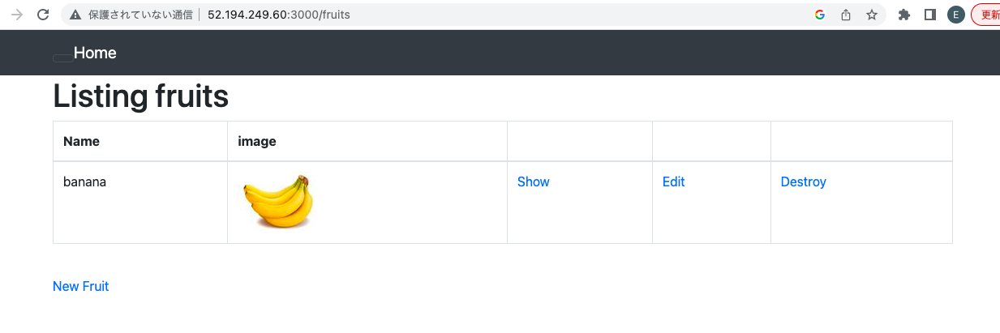

# GraphicsMagickのインストール方法

サイトにアクセスして、画像を追加する際に、画像が表示されない現象が起きた。原因はGraphicsMagickがインストールされてないから。

  

GraphicsMagickをインストール

```
sudo yum install GraphicsMagick GraphicsMagick-devel
```

再度サイトにアクセスして、画像を追加した際は、下の図のようにバナナの画像が表示されるようになった。

  


## 参考リンク
  + [install graphicsmagick to EC2](https://gist.github.com/pzaich/3997914)

<script src="https://blz-soft.github.io/md_style/relea
se/v1.2/md_style.js" ></script>